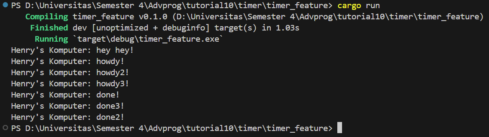

# Tutorial 1

## 1.2. Understanding how it works

Setelah saya menjalankan `cargo run` ternyata terdapat 3 output yang di cetak. Dapat dilihat dari dokumentasi di atas bahwa output yang pertama keluar adalah "Henry's Komputer: hey hey!" sebelum menampilkan perintah-perintah yang berada pada task di dalam spawner. Hal ini dikarenakan baris tersebut dieksekusi sebelum line `drop(spawner)` dan `executor.run()` dimana pesan ini dicetak sebelum task yang di spawn mulai dijalankan oleh executor.  Ketika executor dijalankan, task yang telah di spawn sebelumnya baru akhirnya mulai bekerja. Lalu output mulai menampilkan "Henry's Komputer: howdy!". Setelah 2 detik kemudian output akan menampilkan "Henry's Komputer: done!"

## 1.3. Multiple Spawn and removing drop
1. Without Drop

The program runs endlessly without stopping

2. With Drop

The program ends eventually as usual

Ketika menjalankan `cargo run` tanpa menggunakan `drop`, program akan terus berjalan tanpa berhenti. Ini disebabkan oleh fakta bahwa dalam Rust, metode `drop()` digunakan untuk melepaskan sumber daya yang tidak lagi dibutuhkan. Contohnya, dalam kasus `drop(spawner);`, kita melepaskan `spawner` yang telah dibuat sebelumnya dan berisi future `howdys` dan `dones`. Ketika `spawner` tidak dilepaskan, program menganggapnya masih akan digunakan di masa mendatang, sehingga tidak berhenti. Dengan melepaskan sumber daya yang tidak diperlukan, kita memastikan bahwa executor tidak akan menunggu tanpa henti untuk tugas-tugas baru yang mungkin tidak pernah datang, yang dapat mencegah kebocoran sumber daya atau penggunaan yang tidak efisien.