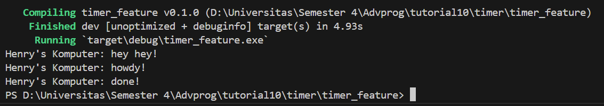

# Tutorial 1

## 1.2. Understanding how it works

Setelah saya menjalankan `cargo run` ternyata terdapat 3 output yang di cetak. Dapat dilihat dari dokumentasi di atas bahwa output yang pertama keluar adalah "Henry's Komputer: hey hey!" sebelum menampilkan perintah-perintah yang berada pada task di dalam spawner. Hal ini dikarenakan baris tersebut dieksekusi sebelum line `drop(spawner)` dan `executor.run()` dimana pesan ini dicetak sebelum task yang di spawn mulai dijalankan oleh executor.  Ketika executor dijalankan, task yang telah di spawn sebelumnya baru akhirnya mulai bekerja. Lalu output mulai menampilkan "Henry's Komputer: howdy!". Setelah 2 detik kemudian output akan menampilkan "Henry's Komputer: done!"